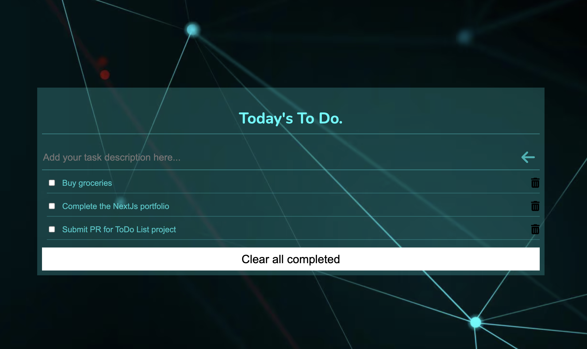

<div align="center">
  <h3><b>TODO LIST README</b></h3>
</div>

<!-- TABLE OF CONTENTS -->

# 📗 Table of Contents

- [📖 About the Project](#about-project)
  - [🛠 Built With](#built-with)
    - [Tech Stack](#tech-stack)
    - [Key Features](#key-features)
  - [🚀 Live Demo](#live-demo)
- [💻 Getting Started](#getting-started)
  - [Setup](#setup)
  - [Prerequisites](#prerequisites)
  - [Install](#install)
  - [Usage](#usage)
  - [Run tests](#run-tests)
  - [Deployment](#triangular_flag_on_post-deployment)
- [👥 Authors](#authors)
- [🔭 Future Features](#future-features)
- [🤝 Contributing](#contributing)
- [⭐️ Show your support](#support)
- [🙏 Acknowledgements](#acknowledgements)
- [❓ FAQ (OPTIONAL)](#faq)
- [📝 License](#license)

<!-- PROJECT DESCRIPTION -->

# 📖 TODO LIST <a name="about-project"></a>

**TODO LIST ** is a simple todo list that keeps track of an individuals tasks. A user can add a task, edit or even delete it. When the task is completed, user is able to mark is as complete. The tasks are sorted using their indices.

## 🛠 Built With <a name="built-with"></a>

### Tech Stack <a name="tech-stack"></a>

<details>
  <summary>Client</summary>
  <ul>
    <li>Javascript</li>
    <li>HTML/CSS</li>
    <li>Webpack</li>
  </ul>
</details>

<details>
  <summary>Server</summary>
  <ul>
    <li>N/A</li>
  </ul>
</details>

<details>
<summary>Database</summary>
  <ul>
    <li>N/A</li>
  </ul>
</details>

<!-- Features -->

### Key Features <a name="key-features"></a>

- Add a todo task
- Edit or delete your todo task
- Mark your task as completed

### Screenshot



<p align="right">(<a href="#readme-top">back to top</a>)</p>

<!-- LIVE DEMO -->

## 🚀 Live Demo <a name="live-demo"></a>

- [Live Demo Link](https://todo-list-webpack.netlify.app)

<p align="right">(<a href="#readme-top">back to top</a>)</p>

<!-- GETTING STARTED -->

## 💻 Getting Started <a name="getting-started"></a>

To get a local copy up and running, follow these steps.

### Prerequisites

In order to run this project you need:
 - NodeJS installed
 - Text Editor preferably VS Code

### Setup

Clone this repository to your desired folder:

```sh
  mkdir todo-list
  cd todo-list
  git clone https://github.com/inspecta/todo-list-webpack.git
```

### Install

Install this project with:

```sh
  cd todo-list-webpack
  npm install
```

### Usage

To run the project, execute the following command:

```sh
  npm start
```

### Run tests

To run linter tests, run the following command:

```sh
  npx eslint .
  npx hint .
  npx stylelint "**/*.{css,scss}"
```

### Deployment

You can deploy this project using:
- GitHub pages
- Netlify

<p align="right">(<a href="#readme-top">back to top</a>)</p>

<!-- AUTHORS -->

## 👥 Authors <a name="authors"></a>

👤 **DERRICK MULINDE**

- GitHub: [@inspecta](https://github.com/inspecta)
- Twitter: [@djmulinde](https://twitter.com/djmulinde)
- LinkedIn: [derrick-mulinde](https://linkedin.com/in/derrick-mulinde)

<p align="right">(<a href="#readme-top">back to top</a>)</p>

<!-- FUTURE FEATURES -->

## 🔭 Future Features <a name="future-features"></a>

- [ ] **A user authentication functionality**
- [ ] **A backend to store these tasks permannently**
- [ ] **A time functionality to remind the user of when to perform a task**

<p align="right">(<a href="#readme-top">back to top</a>)</p>

<!-- CONTRIBUTING -->

## 🤝 Contributing <a name="contributing"></a>

Contributions, issues, and feature requests are welcome!

Feel free to check the [issues page](../../issues/).

<p align="right">(<a href="#readme-top">back to top</a>)</p>

<!-- SUPPORT -->

## ⭐️ Show your support <a name="support"></a>

If you like this project, go ahead and give it a star. It is very much appreciated.

<p align="right">(<a href="#readme-top">back to top</a>)</p>

<!-- ACKNOWLEDGEMENTS -->

## 🙏 Acknowledgments <a name="acknowledgements"></a>


I would like to thank Microverse for providing me with the reading material that helped me during this project development.

<p align="right">(<a href="#readme-top">back to top</a>)</p>

<!-- FAQ (optional) -->

## ❓ FAQ (OPTIONAL) <a name="faq"></a>

- **Can I reuse this projects' code?**

  - Yes, it is okay.

- **Can I contribute to this repository?**

  - Yes. Just contact me at `djmulinde@gmail.com` and I will gladly add you as a contributor to the repository.

<p align="right">(<a href="#readme-top">back to top</a>)</p>

<!-- LICENSE -->

## 📝 License <a name="license"></a>

This project is [MIT](./LICENSE) licensed.

